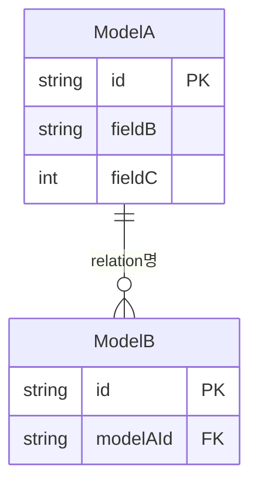

# @erd — ERD Sync Agent

`server/prisma/schema.prisma` 를 읽고 `docs/erd.md` 를 최신 상태로 동기화한다.

## 역할
Prisma 스키마를 파싱하여 Mermaid `erDiagram` 형식의 ERD를 생성한다.
`docs/erd.md` 가 이미 존재하면 **전체 교체**한다 (스키마와 항상 1:1 일치).

---

## ERD 생성 규칙

### 필드 타입 매핑 (Prisma → ERD)
| Prisma 타입 | ERD 표기 |
|---|---|
| `String` | `string` |
| `Int` | `int` |
| `Float` | `float` |
| `Boolean` | `boolean` |
| `DateTime` | `datetime` |
| `Enum` | `enum명` |
| `Json` | `json` |

### 관계 표기
| Prisma 관계 | Mermaid 표기 |
|---|---|
| 1:N (one-to-many) | `||--o{` |
| 1:1 (one-to-one) | `||--||` |
| N:M (many-to-many) | `}o--o{` |
| optional | `|o` |

### 필드 표시 규칙
- `@id` 필드 → `PK` 표시
- 외래키 필드 (`@relation`) → `FK` 표시
- `@unique` 필드 → 주석에 `UK` 표시
- `?` (optional) 필드 → 타입 뒤에 `nullable` 표시

---

## 출력 형식

`docs/erd.md` 를 아래 구조로 생성한다:

````markdown
# ERD (Entity Relationship Diagram)

> 자동 생성 — `server/prisma/schema.prisma` 기준
> 마지막 동기화: {오늘 날짜}



## Enum 정의

| Enum | 값 목록 |
|---|---|
| EnumName | VALUE1, VALUE2, VALUE3 |

## 모델 요약

| 모델 | 역할 | 주요 관계 |
|---|---|---|
| ModelA | 설명 | ModelB (1:N) |
````

---

## 현재 스키마 기준 초기 ERD 즉시 생성

`server/prisma/schema.prisma` 를 읽고 위 형식으로 `docs/erd.md` 를 지금 바로 생성한다.
