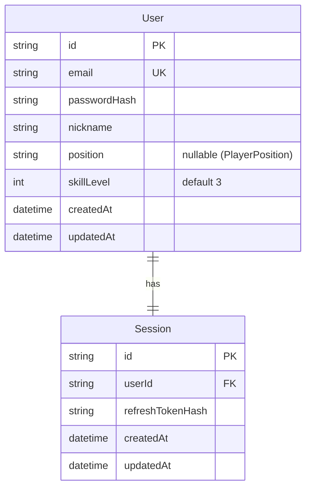

# ERD (Entity Relationship Diagram)

> 자동 생성 — `server/prisma/schema.prisma` 기준
> 마지막 동기화: 2026-04-06

## Enum 정의

| Enum | 값 목록 |
|---|---|
| `PlayerPosition` | FW, MF, DF, GK |

## 모델 요약

| 모델 | 역할 | 주요 관계 |
|---|---|---|
| `User` | 서비스 사용자 (이메일/닉네임/포지션) | Session (1:1) |
| `Session` | 리프레시 토큰 세션 관리 | User (N:1, Cascade 삭제) |
