# ERD (Entity Relationship Diagram)

> **설계 문서** — 전체 도메인 계획 ERD (Phase 1 + Phase 2)  
> 비즈니스 규칙·제약 조건 주석 포함  
> Phase 2 모델은 `[P2]` 로 표시
>
> **구현 현황 ERD** (schema.prisma 자동 생성) → `docs/schema-erd.md`  
> 갱신 방법: `cd server && npx prisma generate`

---

## 전체 ERD

```mermaid
erDiagram

  %% ─── 인증 ────────────────────────────────────────────────────────────

  User {
    string    id                PK
    string    provider          "LOCAL|KAKAO|GOOGLE|APPLE"
    string    providerId
    string    name
    int       birthYear
    string    gender            "MALE|FEMALE|null"
    string    position          "FW|MF|DF|GK"
    string    foot              "LEFT|RIGHT|BOTH"
    int       years
    string    level             "BEGINNER|AMATEUR|SEMI_PRO"
    string    preferredRegionId FK
    string    avatarUrl         "nullable"
    string    status            "ACTIVE|RESTRICTED|DELETED"
    datetime  deletedAt         "nullable - Soft Delete"
    datetime  createdAt
    datetime  updatedAt
  }

  Session {
    string    id                PK
    string    userId            FK "unique"
    string    refreshTokenHash
    datetime  createdAt
    datetime  updatedAt
  }

  %% ─── 지역 ────────────────────────────────────────────────────────────

  Region {
    string    id                PK
    string    name              "시도 예: 서울특별시"
    string    sigungu           "시군구 예: 강남구"
    string    code              "행정구역 코드 UK"
  }

  %% ─── 클럽 ────────────────────────────────────────────────────────────

  Club {
    string    id                PK
    string    name
    string    regionId          FK
    string    level             "BEGINNER|AMATEUR|SEMI_PRO"
    string    description
    string    logoUrl           "nullable"
    int       maxMembers
    string    recruitStatus     "OPEN|CLOSED"
    boolean   isDeleted         "default false"
    datetime  deletedAt         "nullable"
    datetime  createdAt
    datetime  updatedAt
  }

  ClubMember {
    string    id                PK
    string    clubId            FK
    string    userId            FK "unique - 1인1팀"
    string    role              "CAPTAIN|VICE_CAPTAIN|TREASURER|MEMBER"
    int       jerseyNumber      "unique within club"
    int       speed             "nullable"
    int       shooting          "nullable"
    int       passing           "nullable"
    int       dribbling         "nullable"
    int       defense           "nullable"
    int       physical          "nullable"
    boolean   isStatsPublic     "default true"
    datetime  joinedAt
  }

  ClubApplication {
    string    id                PK
    string    clubId            FK
    string    userId            FK
    string    message           "nullable"
    string    status            "PENDING|APPROVED|REJECTED"
    datetime  createdAt
  }

  ClubBanRecord {
    string    id                PK
    string    clubId            FK
    string    userId            FK
    string    bannedById        FK
    string    reason            "nullable"
    datetime  createdAt
  }

  Invitation {
    string    id                PK
    string    clubId            FK
    string    code              UK
    string    createdById       FK
    datetime  expiresAt         "7일 후 만료"
    datetime  createdAt
  }

  %% ─── 경기 ────────────────────────────────────────────────────────────

  Match {
    string    id                PK
    string    clubId            FK
    string    type              "MATCH|FRIENDLY"
    string    title
    string    venue
    datetime  startAt
    datetime  endAt
    datetime  voteDeadline
    string    opponentName      "nullable - 매칭전만"
    string    createdById       FK
    datetime  createdAt
    datetime  updatedAt
  }

  MatchVote {
    string    id                PK
    string    matchId           FK
    string    userId            FK
    string    response          "ATTEND|ABSENT|UNDECIDED"
    datetime  createdAt
  }

  MatchRecord {
    string    id                PK
    string    matchId           FK "unique"
    string    result            "WIN|DRAW|LOSS"
    int       ourScore
    int       opponentScore
    string    recordedById      FK
    boolean   momVoteOpen       "default false"
    datetime  createdAt
    datetime  updatedAt
  }

  MatchRecordHistory {
    string    id                PK
    string    matchRecordId     FK
    string    editedById        FK
    string    fieldName
    string    oldValue
    string    newValue
    datetime  editedAt
  }

  Goal {
    string    id                PK
    string    matchRecordId     FK
    string    scorerId          FK
    int       quarter           "nullable"
    datetime  createdAt
  }

  Assist {
    string    id                PK
    string    matchRecordId     FK
    string    assisterId        FK
    string    goalId            FK
    datetime  createdAt
  }

  PositionAssignment {
    string    id                PK
    string    matchId           FK
    string    userId            FK
    int       quarter
    string    teamLabel         "nullable - 자체전: A|B|..."
    string    formation         "예: 4-3-3"
    string    positionRole      "예: LW, CB"
    datetime  updatedAt
  }

  MomVote {
    string    id                PK
    string    matchId           FK
    string    voterId           FK
    string    candidateId       FK
    datetime  createdAt
  }

  MatchComment {
    string    id                PK
    string    matchId           FK
    string    userId            FK
    string    content
    int       likes             "default 0"
    datetime  createdAt
  }

  MatchVideo {
    string    id                PK
    string    matchId           FK
    string    youtubeUrl
    string    uploadedById      FK
    datetime  createdAt
  }

  OpponentReview {
    string    id                PK
    string    matchId           FK
    string    reviewerId        FK
    float     rating
    string    comment           "nullable"
    datetime  createdAt
  }

  %% ─── 매너 점수 ──────────────────────────────────────────────────────

  MannerScore {
    string    id                PK
    string    userId            FK "평가 대상"
    string    evaluatedById     FK "평가자"
    string    matchId           FK "nullable"
    float     punctuality       "시간 준수"
    float     skill             "실력"
    float     attitude          "태도"
    float     communication     "의사소통"
    string    evaluatorType     "ADMIN|OPPONENT|TEAMMATE"
    datetime  createdAt
  }

  NoShowReport {
    string    id                PK
    string    reportedUserId    FK
    string    reportedById      FK
    string    matchId           FK
    string    status            "PENDING|APPROVED|REJECTED"
    datetime  createdAt
  }

  %% ─── 게시판 ──────────────────────────────────────────────────────────

  Post {
    string    id                PK
    string    clubId            FK
    string    authorId          FK
    string    type              "NOTICE|GENERAL|INQUIRY"
    string    title
    string    content
    boolean   isPinned          "default false"
    int       viewCount         "default 0"
    datetime  createdAt
    datetime  updatedAt
  }

  Comment {
    string    id                PK
    string    postId            FK
    string    authorId          FK
    string    content
    int       likes             "default 0"
    datetime  createdAt
  }

  %% ─── 경기 매칭 [P2] ─────────────────────────────────────────────────

  MatchPost {
    string    id                PK
    string    clubId            FK
    string    createdById       FK
    datetime  matchDate
    string    venue
    int       players
    string    gender            "MALE|FEMALE|MIXED"
    string    level
    int       fee               "nullable"
    string    contactPhone
    string    status            "OPEN|MATCHED|EXPIRED"
    datetime  expiresAt
    datetime  createdAt
  }

  MatchPostApplication {
    string    id                PK
    string    matchPostId       FK
    string    applicantClubId   FK
    string    createdById       FK
    string    message           "nullable"
    string    status            "PENDING|ACCEPTED|REJECTED"
    datetime  createdAt
  }

  %% ─── 용병 [P2] ──────────────────────────────────────────────────────

  MercenaryPost {
    string    id                PK
    string    clubId            FK
    string    createdById       FK
    string    positions         "JSON 배열"
    int       needed
    datetime  matchDate
    string    venue
    string    level
    int       fee               "nullable"
    string    description       "nullable"
    string    status            "OPEN|CLOSED|EXPIRED"
    datetime  createdAt
  }

  MercenaryApplication {
    string    id                PK
    string    mercenaryPostId   FK
    string    applicantId       FK
    string    message           "nullable"
    string    status            "PENDING|ACCEPTED|REJECTED"
    datetime  createdAt
  }

  MercenaryProfile {
    string    id                PK
    string    userId            FK "unique - 1인 1프로필"
    string    positions         "JSON 배열"
    string    availableDates    "JSON 배열"
    string    regionId          FK
    string    timeSlot
    string    introduction      "nullable"
    boolean   wantsFee
    string    status            "ACTIVE|EXPIRED"
    datetime  createdAt
    datetime  updatedAt
  }

  RecruitApplication {
    string    id                PK
    string    mercenaryProfileId FK
    string    clubId            FK
    string    createdById       FK
    string    message           "nullable"
    string    status            "PENDING|ACCEPTED|REJECTED"
    datetime  createdAt
  }

  %% ─── 관계 정의 ───────────────────────────────────────────────────────

  User           ||--o|  Session              : "has"
  User           }o--||  Region               : "prefers"
  User           ||--o{  ClubMember           : "joins"
  User           ||--o{  ClubApplication      : "applies"
  User           ||--o{  MannerScore          : "receives"
  User           ||--o{  NoShowReport         : "reported in"

  Region         ||--o{  Club                 : "located in"
  Region         ||--o{  MercenaryProfile     : "available in"

  Club           ||--o{  ClubMember           : "has"
  Club           ||--o{  ClubApplication      : "receives"
  Club           ||--o{  ClubBanRecord        : "records"
  Club           ||--o{  Invitation           : "issues"
  Club           ||--o{  Match               : "hosts"
  Club           ||--o{  Post                : "has"
  Club           ||--o{  MatchPost           : "posts"
  Club           ||--o{  MercenaryPost       : "posts"
  Club           ||--o{  RecruitApplication  : "sends"

  Match          ||--o{  MatchVote           : "collects"
  Match          ||--o|  MatchRecord         : "has"
  Match          ||--o{  PositionAssignment  : "has"
  Match          ||--o{  MomVote            : "collects"
  Match          ||--o{  MatchComment       : "has"
  Match          ||--o{  MatchVideo         : "has"
  Match          ||--o{  OpponentReview     : "has"
  Match          ||--o{  MannerScore        : "generates"
  Match          ||--o{  NoShowReport       : "related to"

  MatchRecord    ||--o{  Goal               : "has"
  MatchRecord    ||--o{  Assist             : "has"
  MatchRecord    ||--o{  MatchRecordHistory : "tracks"

  Goal           ||--o|  Assist             : "has"

  Post           ||--o{  Comment            : "has"

  MatchPost      ||--o{  MatchPostApplication : "receives"

  MercenaryPost  ||--o{  MercenaryApplication : "receives"

  MercenaryProfile ||--o{ RecruitApplication : "receives"
```

---

## Enum 정의

| Enum                | 값                                       |
| ------------------- | ---------------------------------------- |
| `Provider`          | LOCAL, KAKAO, GOOGLE, APPLE              |
| `Gender`            | MALE, FEMALE                             |
| `PlayerPosition`    | FW, MF, DF, GK                           |
| `Foot`              | LEFT, RIGHT, BOTH                        |
| `Level`             | BEGINNER, AMATEUR, SEMI_PRO              |
| `UserStatus`        | ACTIVE, RESTRICTED, DELETED              |
| `ClubRole`          | CAPTAIN, VICE_CAPTAIN, TREASURER, MEMBER |
| `RecruitStatus`     | OPEN, CLOSED                             |
| `ApplicationStatus` | PENDING, APPROVED, REJECTED              |
| `MatchType`         | MATCH, FRIENDLY                          |
| `VoteResponse`      | ATTEND, ABSENT, UNDECIDED                |
| `MatchResult`       | WIN, DRAW, LOSS                          |
| `PostType`          | NOTICE, GENERAL, INQUIRY                 |
| `MatchStatus`       | OPEN, MATCHED, EXPIRED                   |
| `MercenaryStatus`   | OPEN, CLOSED, EXPIRED                    |
| `ProfileStatus`     | ACTIVE, EXPIRED                          |
| `EvaluatorType`     | ADMIN, OPPONENT, TEAMMATE                |

---

## 모델 요약

### Phase 1 — Core

| 모델                 | 역할                  | 주요 제약                                          |
| -------------------- | --------------------- | -------------------------------------------------- |
| `User`               | 서비스 사용자         | Soft Delete, status 관리                           |
| `Session`            | RT 세션               | userId unique (1인 1세션)                          |
| `Region`             | 행정구역 Seed Data    | code unique                                        |
| `Club`               | 팀                    | Soft Delete                                        |
| `ClubMember`         | 팀원 관계             | userId unique (1인 1팀), jerseyNumber 팀 내 unique |
| `ClubApplication`    | 가입 신청             | (userId, clubId) unique                            |
| `ClubBanRecord`      | 강퇴 이력             | 재가입 제한 블랙리스트                             |
| `Invitation`         | 초대 코드·링크        | code unique, 7일 만료                              |
| `Match`              | 경기 (투표·기록 상위) | startAt + endAt으로 경기 상태 자동 계산            |
| `MatchVote`          | 참석 투표             | (userId, matchId) unique                           |
| `MatchRecord`        | 경기 결과             | matchId unique                                     |
| `MatchRecordHistory` | 기록 수정 이력        | —                                                  |
| `Goal`               | 득점                  | —                                                  |
| `Assist`             | 도움                  | goalId FK                                          |
| `PositionAssignment` | 쿼터별 포지션 배정    | —                                                  |
| `MomVote`            | MOM 투표              | (voterId, matchId) unique                          |
| `MatchComment`       | 경기 댓글             | —                                                  |
| `MatchVideo`         | 경기 영상             | 유튜브 URL                                         |
| `OpponentReview`     | 상대팀 평가           | 매칭전만 생성                                      |
| `MannerScore`        | 매너 점수 이력        | 초기값 100, 자체전 생성 안 함                      |
| `NoShowReport`       | 노쇼 신고             | —                                                  |
| `Post`               | 게시글                | —                                                  |
| `Comment`            | 댓글                  | —                                                  |

### Phase 2 — 매칭·용병

| 모델                   | 역할             | 주요 제약                             |
| ---------------------- | ---------------- | ------------------------------------- |
| `MatchPost`            | 경기 매칭 게시글 | 날짜 경과 시 자동 EXPIRED             |
| `MatchPostApplication` | 매칭 신청        | —                                     |
| `MercenaryPost`        | 용병 구함 게시글 | 날짜 경과 시 자동 EXPIRED             |
| `MercenaryApplication` | 용병 입단 신청   | (mercenaryPostId, applicantId) unique |
| `MercenaryProfile`     | 용병 가능 프로필 | userId unique                         |
| `RecruitApplication`   | 영입 신청        | —                                     |

---

## 핵심 비즈니스 규칙 (DB 제약 요약)

| 규칙                | 구현 위치                                                                         |
| ------------------- | --------------------------------------------------------------------------------- |
| 1인 1팀             | `ClubMember.userId` unique                                                        |
| 등번호 팀 내 unique | `(ClubMember.clubId, ClubMember.jerseyNumber)` unique                             |
| 가입 신청 중복 방지 | `(ClubApplication.userId, ClubApplication.clubId)` unique                         |
| MOM 중복 투표 방지  | `(MomVote.voterId, MomVote.matchId)` unique                                       |
| 투표 중복 방지      | `(MatchVote.userId, MatchVote.matchId)` unique                                    |
| 용병 중복 지원 방지 | `(MercenaryApplication.mercenaryPostId, MercenaryApplication.applicantId)` unique |
| 1인 1세션           | `Session.userId` unique                                                           |
| RT Reuse 감지       | `Session.refreshTokenHash` + timingSafeEqual                                      |
| Soft Delete         | `User.deletedAt`, `Club.deletedAt` IS NULL 필터                                   |
