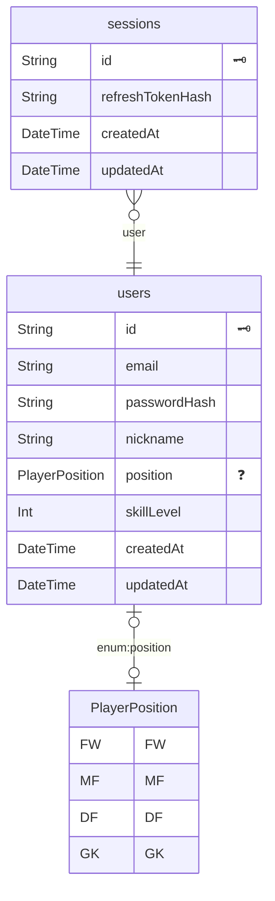

```mermaid
erDiagram

        PlayerPosition {
            FW FW
MF MF
DF DF
GK GK
        }
    
  "users" {
    String id "🗝️"
    String email 
    String passwordHash 
    String nickname 
    PlayerPosition position "❓"
    Int skillLevel 
    DateTime createdAt 
    DateTime updatedAt 
    }
  

  "sessions" {
    String id "🗝️"
    String refreshTokenHash 
    DateTime createdAt 
    DateTime updatedAt 
    }
  
    "users" |o--|o "PlayerPosition" : "enum:position"
    "sessions" }o--|| users : "user"
```
