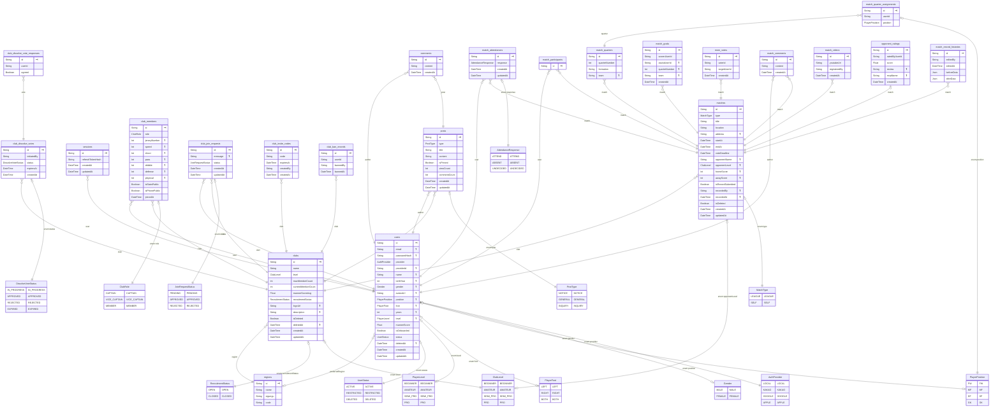

```mermaid
erDiagram

        PlayerPosition {
            FW FW
MF MF
DF DF
GK GK
        }
    


        AuthProvider {
            LOCAL LOCAL
KAKAO KAKAO
GOOGLE GOOGLE
APPLE APPLE
        }
    


        PlayerFoot {
            LEFT LEFT
RIGHT RIGHT
BOTH BOTH
        }
    


        PlayerLevel {
            BEGINNER BEGINNER
AMATEUR AMATEUR
SEMI_PRO SEMI_PRO
PRO PRO
        }
    


        Gender {
            MALE MALE
FEMALE FEMALE
        }
    


        UserStatus {
            ACTIVE ACTIVE
RESTRICTED RESTRICTED
DELETED DELETED
        }
    


        ClubLevel {
            BEGINNER BEGINNER
AMATEUR AMATEUR
SEMI_PRO SEMI_PRO
PRO PRO
        }
    


        RecruitmentStatus {
            OPEN OPEN
CLOSED CLOSED
        }
    


        ClubRole {
            CAPTAIN CAPTAIN
VICE_CAPTAIN VICE_CAPTAIN
MEMBER MEMBER
        }
    


        JoinRequestStatus {
            PENDING PENDING
APPROVED APPROVED
REJECTED REJECTED
        }
    


        PostType {
            NOTICE NOTICE
GENERAL GENERAL
INQUIRY INQUIRY
        }
    


        DissolveVoteStatus {
            IN_PROGRESS IN_PROGRESS
APPROVED APPROVED
REJECTED REJECTED
EXPIRED EXPIRED
        }
    


        MatchType {
            LEAGUE LEAGUE
SELF SELF
        }
    


        AttendanceResponse {
            ATTEND ATTEND
ABSENT ABSENT
UNDECIDED UNDECIDED
        }
    
  "users" {
    String id "🗝️"
    String email "❓"
    String passwordHash "❓"
    AuthProvider provider 
    String providerId "❓"
    String name "❓"
    Int birthYear "❓"
    Gender gender "❓"
    String avatarUrl "❓"
    PlayerPosition position "❓"
    PlayerFoot foot "❓"
    Int years "❓"
    PlayerLevel level "❓"
    Float mannerScore 
    Boolean isOnboarded 
    UserStatus status 
    DateTime deletedAt "❓"
    DateTime createdAt 
    DateTime updatedAt 
    }
  

  "sessions" {
    String id "🗝️"
    String refreshTokenHash 
    DateTime createdAt 
    DateTime updatedAt 
    }
  

  "regions" {
    String id "🗝️"
    String name 
    String sigungu 
    String code 
    }
  

  "clubs" {
    String id "🗝️"
    String name 
    ClubLevel level 
    Int maxMemberCount 
    Int currentMemberCount 
    Float mannerScoreAvg 
    RecruitmentStatus recruitmentStatus 
    String logoUrl "❓"
    String description "❓"
    Boolean isDeleted 
    DateTime deletedAt "❓"
    DateTime createdAt 
    DateTime updatedAt 
    }
  

  "club_members" {
    String id "🗝️"
    ClubRole role 
    Int jerseyNumber "❓"
    Int speed "❓"
    Int shoot "❓"
    Int pass "❓"
    Int dribble "❓"
    Int defense "❓"
    Int physical "❓"
    Boolean isStatsPublic 
    Boolean isPhonePublic 
    DateTime joinedAt 
    }
  

  "club_join_requests" {
    String id "🗝️"
    String message "❓"
    JoinRequestStatus status 
    DateTime createdAt 
    DateTime updatedAt 
    }
  

  "club_invite_codes" {
    String id "🗝️"
    String code 
    DateTime expiresAt 
    String createdBy 
    DateTime createdAt 
    }
  

  "club_ban_records" {
    String id "🗝️"
    String userId 
    String bannedBy 
    DateTime bannedAt 
    }
  

  "club_dissolve_votes" {
    String id "🗝️"
    String initiatedBy 
    DissolveVoteStatus status 
    DateTime expiresAt 
    DateTime createdAt 
    }
  

  "club_dissolve_vote_responses" {
    String id "🗝️"
    String userId 
    Boolean agreed 
    }
  

  "posts" {
    String id "🗝️"
    PostType type 
    String title 
    String content 
    Boolean isPinned 
    Int viewCount 
    Int commentCount 
    DateTime createdAt 
    DateTime updatedAt 
    }
  

  "comments" {
    String id "🗝️"
    String content 
    DateTime createdAt 
    }
  

  "matches" {
    String id "🗝️"
    MatchType type 
    String title 
    String location 
    String address "❓"
    DateTime startAt 
    DateTime endAt 
    DateTime voteDeadline 
    String opponentName "❓"
    ClubLevel opponentLevel "❓"
    Int homeScore "❓"
    Int awayScore "❓"
    Boolean isRecordSubmitted 
    String recordedBy "❓"
    DateTime recordedAt "❓"
    Boolean isDeleted 
    DateTime createdAt 
    DateTime updatedAt 
    }
  

  "match_attendances" {
    String id "🗝️"
    AttendanceResponse response 
    DateTime createdAt 
    DateTime updatedAt 
    }
  

  "match_participants" {
    String id "🗝️"
    }
  

  "match_quarters" {
    String id "🗝️"
    Int quarterNumber 
    String formation 
    String team "❓"
    }
  

  "match_quarter_assignments" {
    String id "🗝️"
    String userId 
    PlayerPosition position 
    }
  

  "match_goals" {
    String id "🗝️"
    String scorerUserId 
    String assistUserId "❓"
    Int quarterNumber "❓"
    String team "❓"
    DateTime createdAt 
    }
  

  "mom_votes" {
    String id "🗝️"
    String voterId 
    String targetUserId 
    DateTime createdAt 
    }
  

  "match_comments" {
    String id "🗝️"
    String content 
    DateTime createdAt 
    }
  

  "match_videos" {
    String id "🗝️"
    String youtubeUrl 
    String registeredBy 
    DateTime createdAt 
    }
  

  "opponent_ratings" {
    String id "🗝️"
    String ratedByUserId 
    Float score 
    String review "❓"
    String mvpName "❓"
    DateTime createdAt 
    }
  

  "match_record_histories" {
    String id "🗝️"
    String editedBy 
    DateTime editedAt 
    Json beforeData 
    Json afterData 
    }
  
    "users" |o--|| "AuthProvider" : "enum:provider"
    "users" |o--|o "Gender" : "enum:gender"
    "users" |o--|o "PlayerPosition" : "enum:position"
    "users" |o--|o "PlayerFoot" : "enum:foot"
    "users" |o--|o "PlayerLevel" : "enum:level"
    "users" |o--|| "UserStatus" : "enum:status"
    "users" }o--|o regions : "preferredRegion"
    "sessions" }o--|| users : "user"
    "clubs" |o--|| "ClubLevel" : "enum:level"
    "clubs" |o--|| "RecruitmentStatus" : "enum:recruitmentStatus"
    "clubs" }o--|| regions : "region"
    "club_members" |o--|| "ClubRole" : "enum:role"
    "club_members" }o--|| clubs : "club"
    "club_members" }o--|| users : "user"
    "club_join_requests" |o--|| "JoinRequestStatus" : "enum:status"
    "club_join_requests" }o--|| clubs : "club"
    "club_join_requests" }o--|| users : "user"
    "club_invite_codes" }o--|| clubs : "club"
    "club_ban_records" }o--|| clubs : "club"
    "club_dissolve_votes" |o--|| "DissolveVoteStatus" : "enum:status"
    "club_dissolve_votes" }o--|| clubs : "club"
    "club_dissolve_vote_responses" }o--|| club_dissolve_votes : "vote"
    "posts" |o--|| "PostType" : "enum:type"
    "posts" }o--|| clubs : "club"
    "posts" }o--|| users : "author"
    "comments" }o--|| posts : "post"
    "comments" }o--|| users : "author"
    "matches" |o--|| "MatchType" : "enum:type"
    "matches" |o--|o "ClubLevel" : "enum:opponentLevel"
    "matches" }o--|| clubs : "club"
    "match_attendances" |o--|| "AttendanceResponse" : "enum:response"
    "match_attendances" }o--|| matches : "match"
    "match_attendances" }o--|| users : "user"
    "match_participants" }o--|| matches : "match"
    "match_participants" }o--|| users : "user"
    "match_quarters" }o--|| matches : "match"
    "match_quarter_assignments" |o--|| "PlayerPosition" : "enum:position"
    "match_quarter_assignments" }o--|| match_quarters : "quarter"
    "match_goals" }o--|| matches : "match"
    "mom_votes" }o--|| matches : "match"
    "match_comments" }o--|| matches : "match"
    "match_comments" }o--|| users : "author"
    "match_videos" }o--|| matches : "match"
    "opponent_ratings" |o--|| matches : "match"
    "match_record_histories" }o--|| matches : "match"
```
