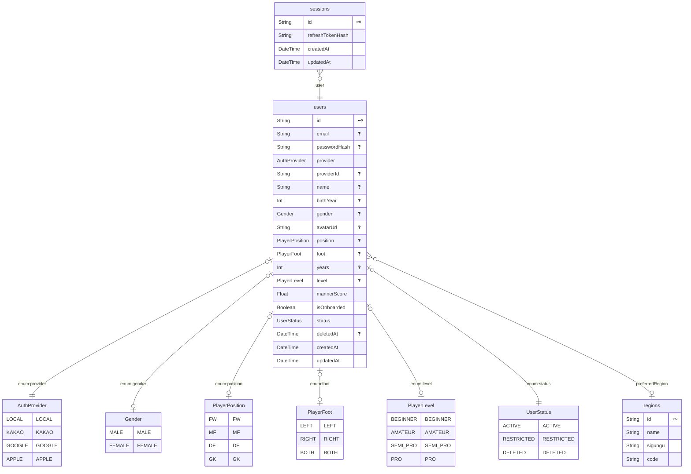

```mermaid
erDiagram

        PlayerPosition {
            FW FW
MF MF
DF DF
GK GK
        }
    


        AuthProvider {
            LOCAL LOCAL
KAKAO KAKAO
GOOGLE GOOGLE
APPLE APPLE
        }
    


        PlayerFoot {
            LEFT LEFT
RIGHT RIGHT
BOTH BOTH
        }
    


        PlayerLevel {
            BEGINNER BEGINNER
AMATEUR AMATEUR
SEMI_PRO SEMI_PRO
PRO PRO
        }
    


        Gender {
            MALE MALE
FEMALE FEMALE
        }
    


        UserStatus {
            ACTIVE ACTIVE
RESTRICTED RESTRICTED
DELETED DELETED
        }
    
  "users" {
    String id "🗝️"
    String email "❓"
    String passwordHash "❓"
    AuthProvider provider 
    String providerId "❓"
    String name "❓"
    Int birthYear "❓"
    Gender gender "❓"
    String avatarUrl "❓"
    PlayerPosition position "❓"
    PlayerFoot foot "❓"
    Int years "❓"
    PlayerLevel level "❓"
    Float mannerScore 
    Boolean isOnboarded 
    UserStatus status 
    DateTime deletedAt "❓"
    DateTime createdAt 
    DateTime updatedAt 
    }
  

  "sessions" {
    String id "🗝️"
    String refreshTokenHash 
    DateTime createdAt 
    DateTime updatedAt 
    }
  

  "regions" {
    String id "🗝️"
    String name 
    String sigungu 
    String code 
    }
  
    "users" |o--|| "AuthProvider" : "enum:provider"
    "users" |o--|o "Gender" : "enum:gender"
    "users" |o--|o "PlayerPosition" : "enum:position"
    "users" |o--|o "PlayerFoot" : "enum:foot"
    "users" |o--|o "PlayerLevel" : "enum:level"
    "users" |o--|| "UserStatus" : "enum:status"
    "users" }o--|o regions : "preferredRegion"
    "sessions" }o--|| users : "user"
```
